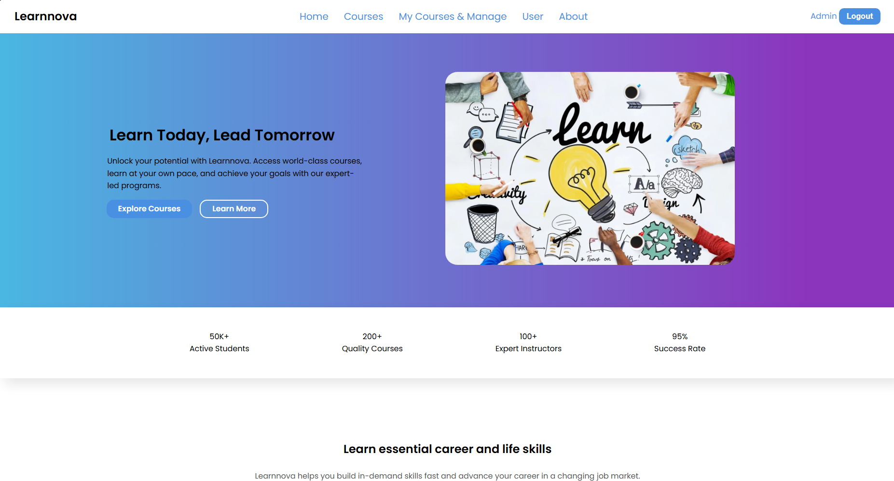

# LearnNova 📚 - Online Learning Platform


**LearnNova** is a comprehensive web-based E-Learning platform built with the **Laravel Framework**. It provides a dynamic environment where **Experts** can create and manage courses, while **Students** can browse, enroll, and take lessons with interactive features.




## 🌟 Key Features

* **🔐 Authentication & Roles:** Secure login and registration system with distinct roles for **Students** and **Experts**.
* **👥 Role Management:**
    * **Students:** Enroll in courses, track progress, view lessons, and review courses.
    * **Experts:** Create, update, and delete courses and lessons.
* **📚 Course Management:**
    * Browse and search for courses in real-time (powered by **Livewire**).
    * Detailed course views with lesson lists and progress tracking.
* **📝 Interactive Quizzes:** Integrated quiz system (e.g., Japanese Language Quiz) to test student knowledge.
* **⭐ Review System:** Students can leave ratings and reviews for courses they have attended.
* **👤 User Profiles:** Manage personal information and view enrolled/created courses.

## 🛠️ Tech Stack

* **Backend Framework:** Laravel 11
* **Frontend:** Blade Templates, Tailwind CSS
* **Interactivity:** Laravel Livewire (for dynamic search and components)
* **Database:** MySQL
* **Build Tool:** Vite

## 🚀 Installation & Setup

Follow these steps to set up the project locally on your machine.

### Prerequisites
* PHP 8.2 or higher
* Composer
* Node.js & NPM
* MySQL

### Steps

1.  **Clone the Repository**
    ```bash
    git clone [https://github.com/rinriku69/learnnova.git](https://github.com/rinriku69/learnnova.git)
    cd learnnova
    ```

2.  **Install PHP Dependencies**
    ```bash
    composer install
    ```

3.  **Install Frontend Dependencies**
    ```bash
    npm install
    npm run build
    ```

4.  **Environment Configuration**
    * Copy the example environment file:
        ```bash
        cp .env.example .env
        ```
    * Open the `.env` file and configure your database settings:
        ```env
        DB_CONNECTION=mysql
        DB_HOST=127.0.0.1
        DB_PORT=3306
        DB_DATABASE=learnnova
        DB_USERNAME=root
        DB_PASSWORD=
        ```

5.  **Generate Application Key**
    ```bash
    php artisan key:generate
    ```

6.  **Database Migration & Seeding**
    * This command will create all necessary tables and populate them with sample data (Users, Courses, Lessons, etc.):
    ```bash
    php artisan migrate --seed
    ```

7.  **Run the Application**
    * Start the Laravel development server:
    ```bash
    php artisan serve
    ```
    * (Optional) If you are working on frontend assets, run Vite in a separate terminal:
    ```bash
    npm run dev
    ```

8.  **Access the App**
    * Open your browser and visit: `http://localhost:8000`

---

## 📂 Project Structure Overview

* `app/Http/Controllers`: Handles core logic (Courses, Lessons, Quizzes, Auth).
* `app/Livewire`: Contains real-time components like `SearchCourses`.
* `app/Models`: Eloquent models representing database tables (User, Course, Lesson, Review).
* `database/migrations`: Schemas for the database tables.
* `database/seeders`: Populates the database with initial testing data.
* `resources/views`: Frontend Blade templates.

## 🤝 Contributing

Contributions are welcome! If you'd like to improve this project:
1.  Fork the repository.
2.  Create a new branch (`git checkout -b feature/AmazingFeature`).
3.  Commit your changes (`git commit -m 'Add some AmazingFeature'`).
4.  Push to the branch (`git push origin feature/AmazingFeature`).
5.  Open a Pull Request.

---


